# Stream Engines: Azure Stream Analytics

## Introduction

TODO

## Azure Environment Setup

### 1. Resource Group

Created a Resource Group to organize all Azure resources used in the assignment.

A Resource Group acts as a logical "folder" where related Azure services are grouped together. In this project, it contains the Event Hubs resources, the Storage Account, and later the Stream Analytics jobs. This makes the setup easier to manage, monitor and clean up.

### 2. Event Hubs Namespace

Created an Event Hubs Namespace to group and manage the Event Hub used in this project. The namespace acts as the parent "container" for the Event Hub that receives the real-time ATM transaction events generated by the Python script.

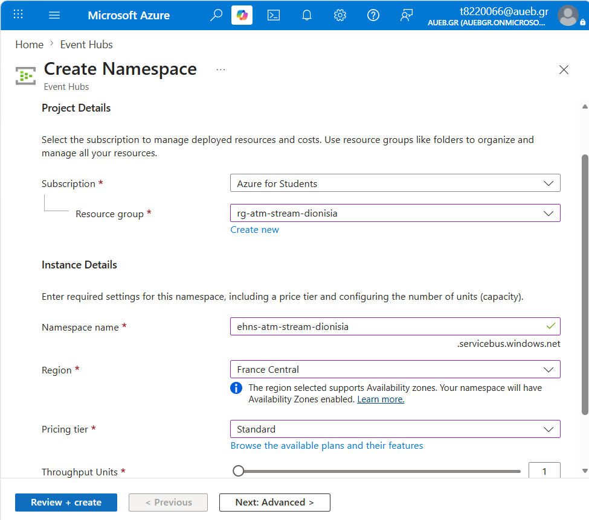

\*\***Note**: Throughout the setup, I use France Central as the selected region, because it is included in the eligible list of locations available for my Azure for Students subscription, as shown below:

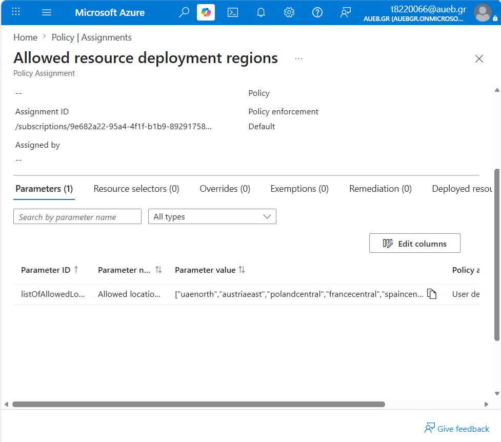

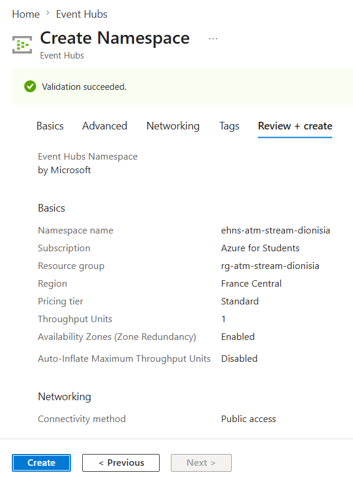
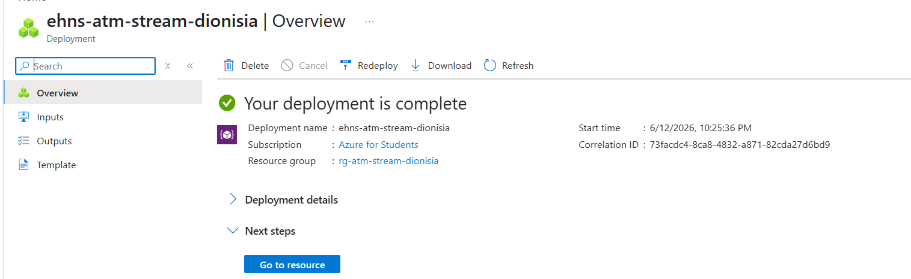

### 3. Event Hub

Created an Event Hub for real-time ingestion of ATM transaction events.

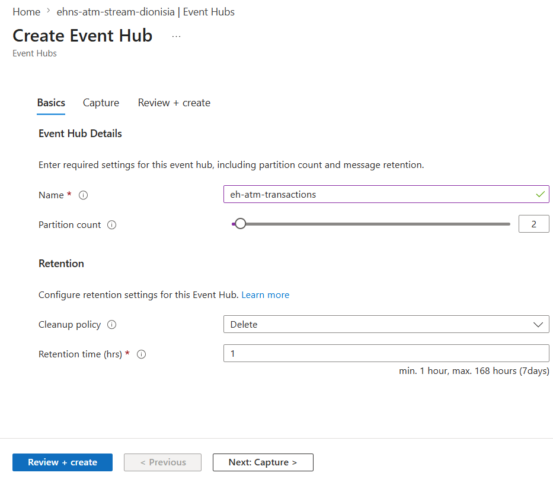

\*\***Note**: The Event Hub was configured with Partition Count = 2.

Partitions define how incoming events are internally distributed and read within the Event Hub. They allow the event stream to be split into multiple parallel sequences.

For example:

- 1 partition → all events are written into one stream
- 2 partitions → events can be distributed across two streams

In the provided _atm_generator.py script_, each event is sent using _accountId_ as the _partition key_. This means that all events belonging to the same account are consistently routed to the same partition, while events from different accounts can be distributed across the available partitions.

This configuration is useful because it keeps events for the same account logically grouped, while still allowing the Event Hub to distribute traffic across more than one partition.

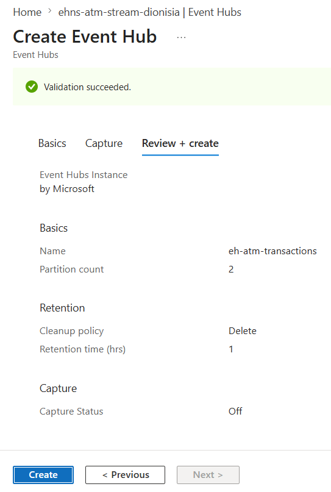
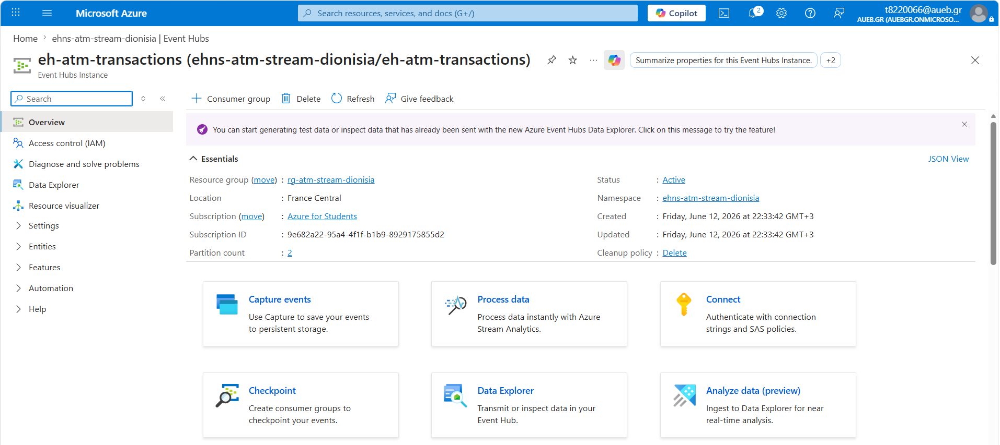

### 4. Shared Access Policy

Created a dedicated send policy for the Python event generator.

The access key is stored locally in `.env` and is not committed to GitHub.

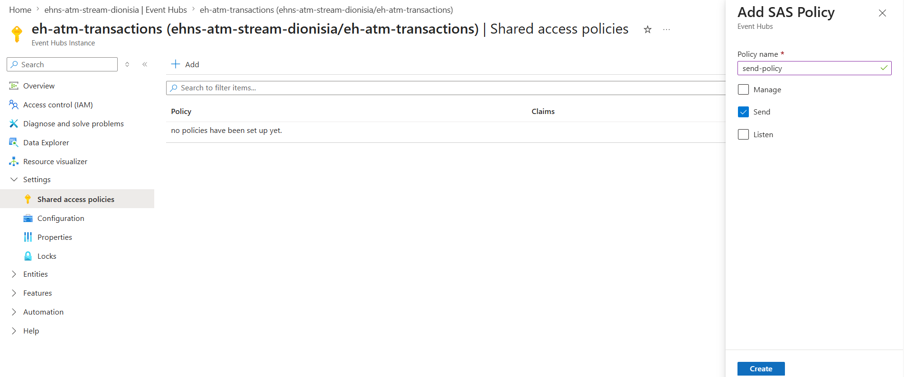
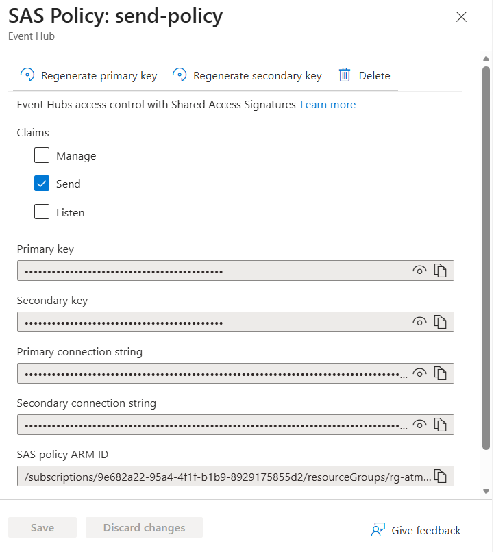

### 5. Consumer Groups

Created separate consumer groups for the five Stream Analytics jobs, so each job can independently read the same event stream.

- cg-task1
- cg-task2
- cg-task3
- cg-task4
- cg-task5

A Consumer Group can be understood as an independent view of the same Event Hub stream. It does not duplicate the data. Instead, it allows each consumer to keep its own reading position.

For example:

- cg-task1 reads the stream to calculate transaction volume per area
- cg-task2 reads the same stream to detect high-value withdrawals
- cg-task3 reads the same stream to detect burst activity per account

All Stream Analytics jobs read the same ATM events, but each job applies a different query and writes to a different output. By assigning a separate consumer group to each job, every job can process the full stream independently.

If all jobs used the same consumer group, they would share the same reading group, which could cause conflicts or unexpected behavior when multiple readers access the same partitions. For this reason, one consumer group per Stream Analytics job is a cleaner and safer setup.

Each job will later use the same Event Hub as input, but it will write its results to its own Blob container.

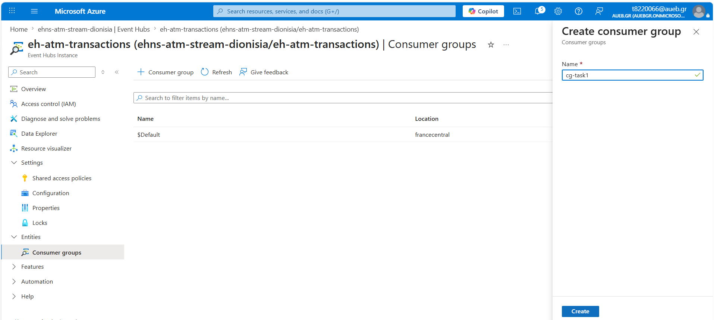
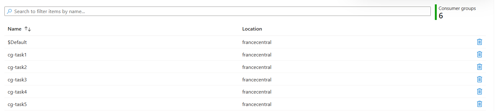

### 6. Storage Account

Created a Storage Account to store the JSON outputs produced by the Stream Analytics jobs.

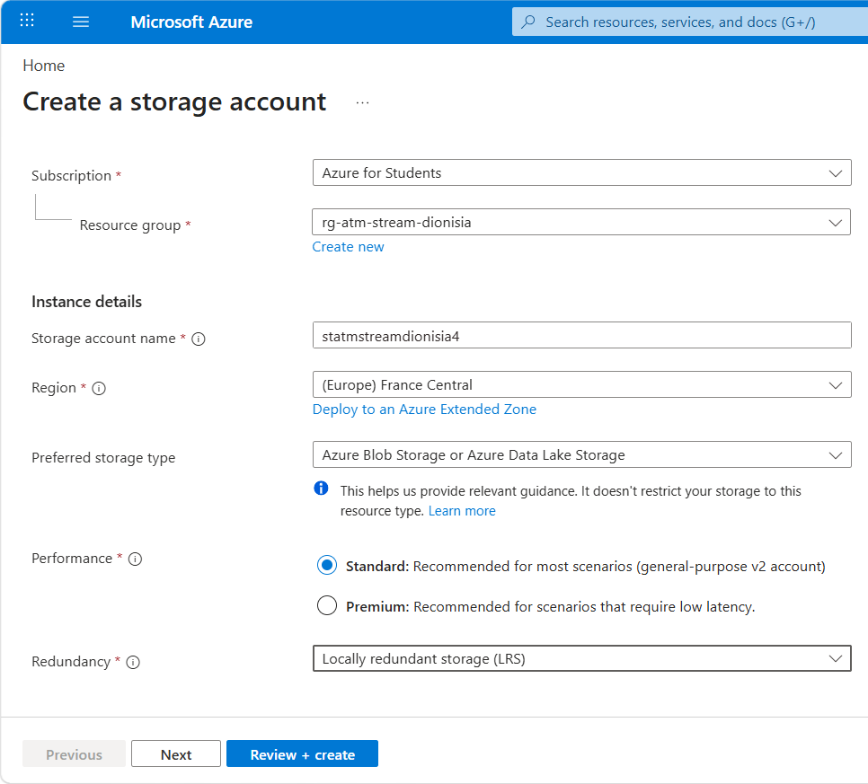
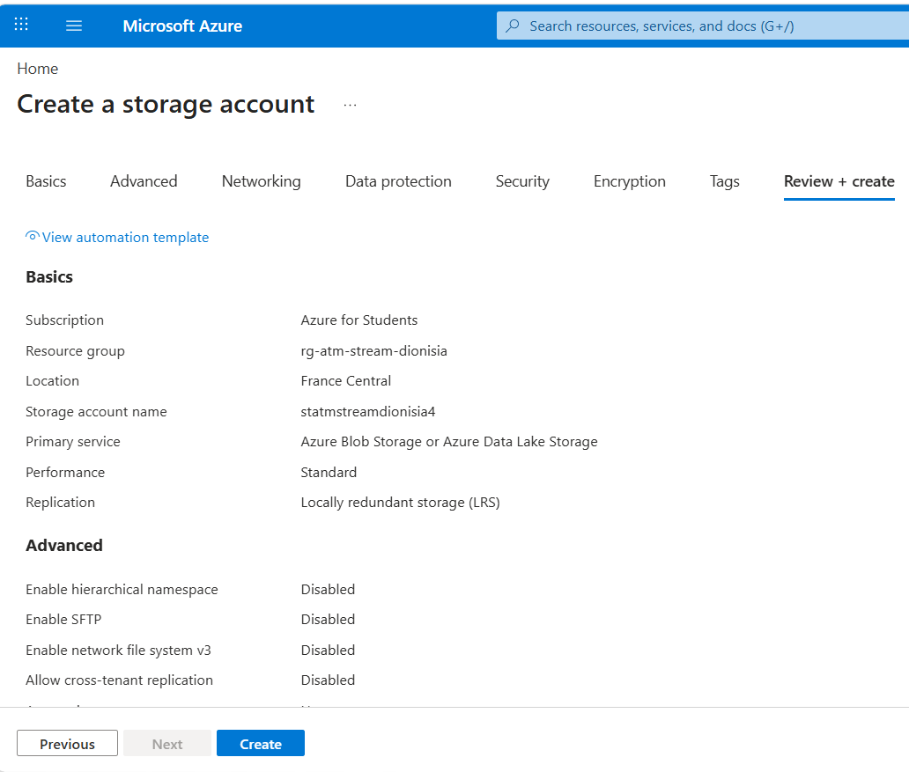
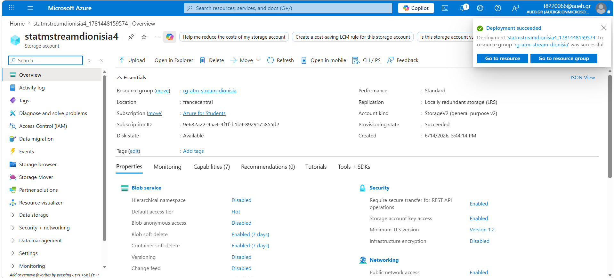

### 7. Blob Containers

Created five private Blob containers, one for each Stream Analytics task.

- task1-volume-area
- task2-high-value-withdrawals
- task3-burst-account
- task4-avg-withdrawal-area
- task5-type-distribution

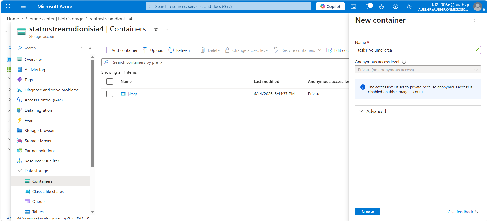
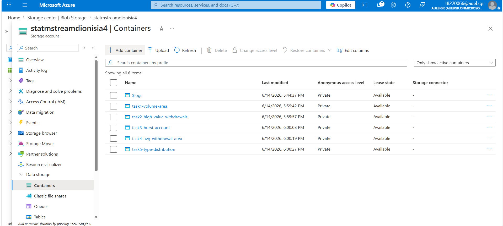

## Event Generator

The event generator is implemented in Python and is located under the directory: `src/atm_generator.py`

This script generates simulated ATM transaction events and sends them continuously to the Azure Event Hub. Each event contains fields such as eventTime, area, atmId, accountId, transactionType, amount and currency.

The original configuration values at the beginning of the script were replaced with environment variables. This was done to avoid hardcoding Azure credentials directly in the source code. The script now reads the required values from a local `.env` file:

```
HOST_NAME=...
SHARED_ACCESS_KEY_NAME=...
SHARED_ACCESS_KEY=...
EVENT_HUB_NAME=...
```

The `.env` file is used only locally and is excluded from GitHub through `.gitignore`.

To support loading environment variables from the `.env` file, the `python-dotenv` package was added to `requirements.txt`.

### Run

---

- From the root directory of the project, create and activate a virtual environment:

```
python -m venv .venv
.venv\Scripts\activate
```

- Install the required dependencies:

`pip install -r requirements.txt`

- Run the event generator:

`python src/atm_generator.py`

If the configuration is correct, the script connects to the Event Hub and starts sending ATM transaction events continuously, as shown below:

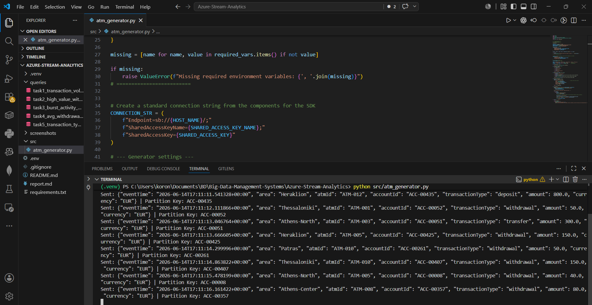
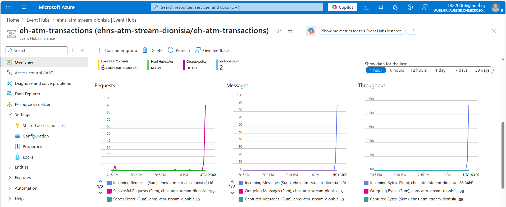

## Queries

The Stream Analytics queries are stored in the `queries/` directory. Each query corresponds to one of the five required tasks and will later be used inside a separate Azure Stream Analytics job.

All queries follow the same general structure:

```
SELECT
    ...,
    System.Timestamp() AS windowEnd
INTO
    outputAlias
FROM
    inputAlias TIMESTAMP BY eventTime
WHERE
    ...
GROUP BY
    ...,
    WindowFunction(...)
```

The `SELECT` clause defines the fields and aggregations that will be written to the output.

The `INTO` clause defines the output alias of the Stream Analytics job. This alias must match the name of the output configured in Azure Stream Analytics.

The `FROM` clause defines the input alias. In this project, the input alias used in the queries is: `atmInput`.

This alias will later be configured to read data from the Azure Event Hub.

The following part is especially important:

TIMESTAMP BY eventTime

Each ATM event generated by the Python script contains its own event timestamp in the eventTime field. By using TIMESTAMP BY eventTime, Azure Stream Analytics processes the events based on the actual event time instead of only using the time when the event arrived in Azure.

The WHERE clause is used only when a query needs to filter specific events before aggregation. For example, some tasks only consider withdrawal transactions or withdrawals with an amount greater than or equal to 200.

The GROUP BY clause defines how the events are grouped before calculating the aggregations. For example, results can be grouped by area, accountId, or transactionType.

The WindowFunction(...) defines the time window over which the stream is analyzed. Since streaming data is continuous, the query needs a time window to decide which events belong together for each calculation.

Finally, this field is included in the output:

System.Timestamp() AS windowEnd

System.Timestamp() returns the timestamp associated with the produced result. In windowed aggregations, this is commonly used to indicate the end time of the window for which the result was calculated. This makes the output easier to interpret, because each result row shows not only the aggregation values but also the time period they refer to.

In this project, the input alias is kept the same for all jobs:

atmInput

The output aliases are different for each task:

task1Output
task2Output
task3Output
task4Output
task5Output

When the Stream Analytics jobs are created in Azure, the input and output aliases must match exactly the names used inside the SQL queries.

Window Functions

Window functions are necessary in stream processing because the data does not have a fixed end. Events arrive continuously, so calculations must be performed over specific time intervals.

This assignment uses three types of windows: Tumbling, Hopping, and Sliding.

Tumbling Window

A Tumbling Window splits the stream into fixed-size, non-overlapping time intervals. Each event belongs to exactly one window.

Example:

12:00 - 12:01
12:01 - 12:02
12:02 - 12:03

If a query uses:

TumblingWindow(minute, 1)

then Azure Stream Analytics calculates one result for each complete one-minute interval.

This type of window is useful when the goal is to produce regular summaries, such as the total number of transactions per area every 1 minute.

Hopping Window

A Hopping Window also has a fixed duration, but the windows can overlap. It uses two values: the window size and the hop size.

Example:

HoppingWindow(minute, 10, 1)

This means:

Window size: 10 minutes
Hop size: 1 minute

So, every 1 minute, the query calculates results using the events from the last 10 minutes.

Example intervals:

12:00 - 12:10
12:01 - 12:11
12:02 - 12:12

This type of window is useful when the goal is to continuously monitor recent activity, such as counting high-value withdrawals in each area during the last 10 minutes.

Sliding Window

A Sliding Window looks for events that occur within a moving time interval. It produces results when events enter or leave the window and the aggregation condition is satisfied.

Example:

SlidingWindow(second, 30)

This means that Azure Stream Analytics evaluates activity within a 30-second time range.

This type of window is useful for detecting patterns that can happen at any moment, not only at fixed time boundaries. In this project, it is used to detect burst activity, where an account performs 3 or more transactions within 30 seconds.

For example, if the same account performs transactions at:

12:00:05
12:00:15
12:00:25

then all three transactions fall within a 30-second sliding window, and the account can be flagged as suspicious.

## Stream Analytics Jobs

Create the First Stream Analytics Job for the Task 1.

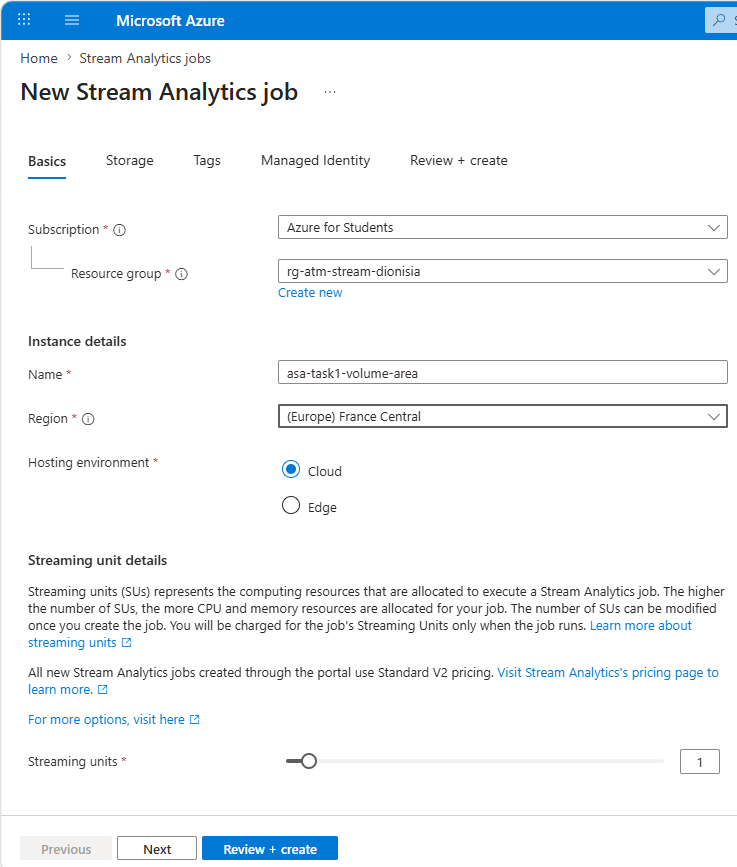
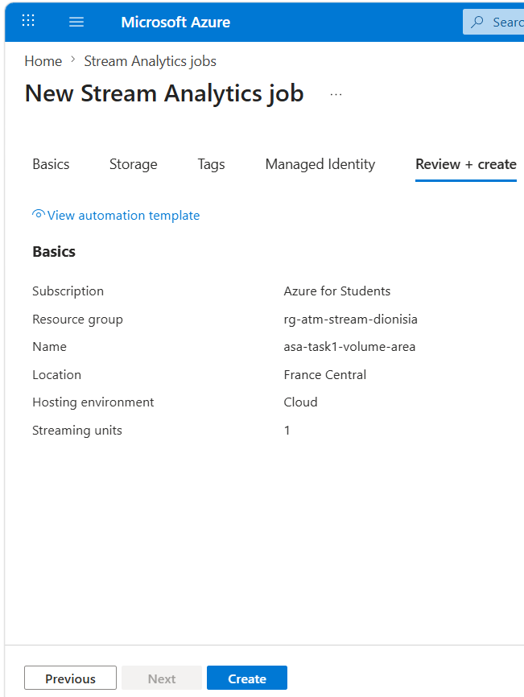
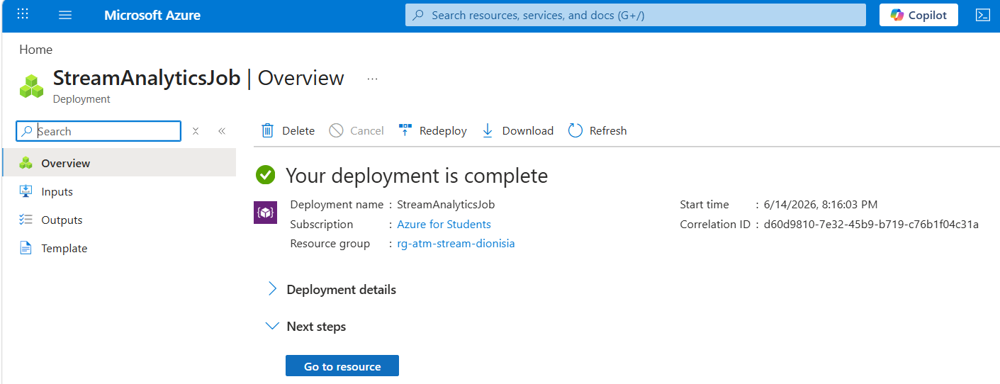

Insert Input, Output and the Query involved.

Start the job. After a few minutes, stop the job and then the results will be at the ""
