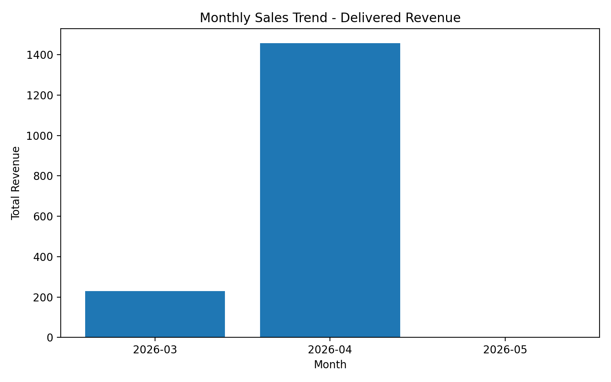

1. Introduction
2. Schema Design
3. Embedding Decision Justification
4. Queries
   - Books Query
   - Array Tags Query
   - Full-text Search
   - Nested Customer Query
   - Embedded Array Query
   - Date Range Query
5. Aggregation Pipelines
   - Revenue by Category
   - Customer Lifetime Value
   - Monthly Sales Trend
   - Vendor Performance Report

# 1. Introduction

In this assignment I design, populate, and query a MongoDB database that models a simplified e-commerce platform. You will practice the full lifecycle of a MongoDB application: schema design for a document-oriented store, bulk and conditional data ingestion, expressive query construction, and multi-stage aggregation pipelines.

# 2. Schema Design

The database for ShopNest consists of four main collections: `products`, `customers`, `orders`, and `vendors`. Each collection is designed following MongoDB's document-oriented model, with a focus on performance, readability, and real-world e-commerce requirements.

---

## Products Collection

```js
{
  _id: ObjectId,            // auto-generated
  sku: String,              // unique, e.g. "SNT-1001"
  name: String,
  category: String,         // "Electronics" | "Books" | "Clothing" | ...
  vendor_id: ObjectId,      // references vendors._id
  price: NumberDecimal,
  stock: NumberInt,
  ratings: {
    average: Number,        // 1.0 – 5.0
    count: NumberInt
  },
  tags: [String],
  created_at: Date
}
```

## Customers Collection

```js
{
  _id: ObjectId,
  email: String,            // unique
  name: String,
  address: {
    city: String,
    country: String
  },
  tier: String,             // "bronze" | "silver" | "gold"
  joined_at: Date
}
```

## Orders Collection

```js
{
  _id: ObjectId,
  customer_id: ObjectId,    // references customers._id
  status: String,           // "pending" | "shipped" | "delivered" | "cancelled"
  items: [                  // embedded array — no join needed for totals
    {
      product_id: ObjectId,
      sku: String,
      name: String,         // repeated for read performance
      qty: NumberInt,
      unit_price: NumberDecimal
    }
  ],
  total: NumberDecimal,     // pre-computed sum of items
  created_at: Date
}
```

## Vendors Collection

```js
{
  _id: ObjectId,
  name: String,
  email: String,
  country: String,
  created_at: Date
}
```

# 3. Embedding Decision Justification

In this design, order line items are embedded directly inside the `orders` collection rather than stored in a separate `order_items` collection. This decision is primarily driven by the expected read-heavy access pattern of an e-commerce system. In most cases, when an order is retrieved, all of its associated items are needed together (e.g., for order history or invoice display). Embedding eliminates the need for joins, improving read performance and simplifying queries such as total calculation.

Regarding document size, MongoDB enforces a 16MB BSON document limit. In this application, each order is expected to contain a reasonable number of items, so this limit is unlikely to be exceeded.

However, if order items were frequently updated independently (e.g., changing quantities, prices, or availability after the order is created) or if each order could contain a very large number of items, embedding would become inefficient. In such cases, storing order items in a separate `order_items` collection would be preferable, as it would reduce document size, avoid frequent rewriting of large documents, and provide better flexibility and scalability for write-heavy operations.

# 5. Queries

```
=====================================================
Query 1: Books with good ratings and in stock, sorted by price
=====================================================
Description:
This query returns available Books products with an average rating of at least 4.0 and stock greater than 0, sorted by price in ascending order.

First 3 result documents:
[
 {
   name: 'Mystery Novel',
   price: Decimal128('12.99'),
   ratings: {
     average: 4.3
   },
   tags: [
     'fiction',
     'new-arrival'
   ]
 },
 {
   name: 'JavaScript Basics',
   price: Decimal128('19.99'),
   ratings: {
     average: 4
   },
   tags: [
     'programming',
     'sale'
   ]
 },
 {
   name: 'MongoDB Practical Guide',
   price: Decimal128('25.99'),
   ratings: {
     average: 4.5
   },
   tags: [
     'database',
     'featured',
     'new-arrival'
   ]
 }
]

=====================================================
Query 2: Products tagged with both new-arrival and featured
=====================================================
Description:
This query returns products that contain both the new-arrival and featured tags.

First 3 result documents:
[
 {
   sku: 'SNT-1001',
   name: 'Wireless Headphones',
   category: 'Electronics',
   price: Decimal128('80.9910'),
   tags: [
     'wireless',
     'headphones',
     'featured',
     'new-arrival'
   ]
 },
 {
   sku: 'SNT-2001',
   name: 'MongoDB Practical Guide',
   category: 'Books',
   price: Decimal128('25.99'),
   tags: [
     'database',
     'featured',
     'new-arrival'
   ]
 },
 {
   sku: 'SNT-3003',
   name: 'Running Sneakers',
   category: 'Clothing',
   price: Decimal128('74.99'),
   tags: [
     'shoes',
     'new-arrival',
     'featured'
   ]
 }
]

=====================================================
Query 2B: Products tagged with either clearance or sale
=====================================================
Description:
This query returns products that contain either the clearance tag or the sale tag.

First 3 result documents:
[
 {
   sku: 'SNT-1002',
   name: 'Bluetooth Speaker',
   category: 'Electronics',
   price: Decimal128('53.9910'),
   tags: [
     'wireless',
     'audio',
     'sale'
   ]
 },
 {
   sku: 'SNT-1004',
   name: 'Mechanical Keyboard',
   category: 'Electronics',
   price: Decimal128('98.9910'),
   tags: [
     'keyboard',
     'gaming',
     'featured',
     'sale'
   ]
 },
 {
   sku: 'SNT-2002',
   name: 'JavaScript Basics',
   category: 'Books',
   price: Decimal128('19.99'),
   tags: [
     'programming',
     'sale'
   ]
 }
]

=====================================================
Query 3: Full-text search for wireless headphones
=====================================================
Description:
This query performs a full-text search for products matching wireless headphones and sorts the results by text relevance score.

First 3 result documents:
[
 {
   name: 'Wireless Headphones',
   price: Decimal128('80.9910'),
   score: 3.6
 },
 {
   name: 'Bluetooth Speaker',
   price: Decimal128('53.9910'),
   score: 1.1
 }
]

=====================================================
Query 4: Gold customers from Greece or Germany
=====================================================
Description:
This query returns gold-tier customers whose country is either Greece or Germany.

First 3 result documents:
[
 {
   email: 'eleni.papadopoulou@example.com',
   name: 'Eleni Papadopoulou',
   address: {
     city: 'Athens',
     country: 'Greece'
   }
 },
 {
   email: 'anna.mueller@example.com',
   name: 'Anna Mueller',
   address: {
     city: 'Berlin',
     country: 'Germany'
   }
 }
]

=====================================================
Query 5: Orders containing at least one line item with qty > 3
=====================================================
Description:
This query returns orders that contain at least one embedded line item with a quantity greater than 3.

First 3 result documents:
[
 {
   _id: ObjectId('69fa59bd9e643ba905abc13f'),
   customer_id: ObjectId('69fa59bd9e643ba905abc119'),
   status: 'delivered',
   items: [
     {
       product_id: ObjectId('69fa59bd9e643ba905abc132'),
       sku: 'SNT-4003',
       name: 'Reusable Water Bottle',
       qty: 4,
       unit_price: Decimal128('11.99')
     }
   ],
   total: Decimal128('47.96'),
   created_at: ISODate('2026-04-12T08:45:00.000Z')
 },
 {
   _id: ObjectId('69fa59bd9e643ba905abc150'),
   customer_id: ObjectId('69fa59bd9e643ba905abc11e'),
   status: 'delivered',
   items: [
     {
       product_id: ObjectId('69fa59bd9e643ba905abc132'),
       sku: 'SNT-4003',
       name: 'Reusable Water Bottle',
       qty: 5,
       unit_price: Decimal128('11.99')
     }
   ],
   total: Decimal128('59.95'),
   created_at: ISODate('2026-03-22T09:30:00.000Z')
 }
]

=====================================================
Query 6: Delivered orders in the last 30 days
=====================================================
Description:
This query returns delivered orders placed within the last 30 days of the seed dataset, sorted from newest to oldest.

First 3 result documents:
[
 {
   _id: ObjectId('69fa59bd9e643ba905abc135'),
   customer_id: ObjectId('69fa59bd9e643ba905abc117'),
   status: 'delivered',
   items: [
     {
       product_id: ObjectId('69fa59bd9e643ba905abc121'),
       sku: 'SNT-1001',
       name: 'Wireless Headphones',
       qty: 1,
       unit_price: Decimal128('89.99')
     },
     {
       product_id: ObjectId('69fa59bd9e643ba905abc125'),
       sku: 'SNT-1005',
       name: 'USB-C Hub',
       qty: 2,
       unit_price: Decimal128('24.99')
     }
   ],
   total: Decimal128('139.97'),
   created_at: ISODate('2026-04-30T10:00:00.000Z')
 },
 {
   _id: ObjectId('69fa59bd9e643ba905abc146'),
   customer_id: ObjectId('69fa59bd9e643ba905abc11b'),
   status: 'delivered',
   items: [
     {
       product_id: ObjectId('69fa59bd9e643ba905abc123'),
       sku: 'SNT-1003',
       name: 'Smartwatch',
       qty: 1,
       unit_price: Decimal128('149.99')
     }
   ],
   total: Decimal128('149.99'),
   created_at: ISODate('2026-04-29T14:30:00.000Z')
 },
 {
   _id: ObjectId('69fa59bd9e643ba905abc13b'),
   customer_id: ObjectId('69fa59bd9e643ba905abc118'),
   status: 'delivered',
   items: [
     {
       product_id: ObjectId('69fa59bd9e643ba905abc121'),
       sku: 'SNT-1001',
       name: 'Wireless Headphones',
       qty: 2,
       unit_price: Decimal128('89.99')
     }
   ],
   total: Decimal128('179.98'),
   created_at: ISODate('2026-04-28T10:10:00.000Z')
 }
]


```

# 6. Aggregation Pipelines

```

  =====================================================
  Aggregation 1: Revenue by category
  =====================================================
  Description:
  This aggregation computes total delivered-order revenue and the number of distinct products sold for each product category.

  Aggregation results:
  [
    {
      total_revenue: Decimal128('639.92'),
      category: 'Electronics',
      products_sold: 5
    },
    {
      total_revenue: Decimal128('494.92'),
      category: 'Clothing',
      products_sold: 4
    },
    {
      total_revenue: Decimal128('292.87'),
      category: 'Home',
      products_sold: 3
    },
    {
      total_revenue: Decimal128('205.91'),
      category: 'Books',
      products_sold: 5
    },
    {
      total_revenue: Decimal128('52.98'),
      category: 'Wellness',
      products_sold: 2
    }
  ]

  =====================================================
  Aggregation 2: Customer lifetime value
  =====================================================
  Description:
  This aggregation calculates each customer's order count, delivered-order spending, average order value, and favourite delivered-order category, then returns the top 10 customers by spending.

  Aggregation results:
  [
    {
      total_orders: 4,
      total_spent: Decimal128('294.96'),
      customer_id: ObjectId('69fa59bd9e643ba905abc118'),
      customer_name: 'Nikos Georgiou',
      avg_order_value: Decimal128('106.86'),
      favourite_category: 'Clothing'
    },
    {
      total_orders: 3,
      total_spent: Decimal128('289.96'),
      customer_id: ObjectId('69fa59bd9e643ba905abc11d'),
      customer_name: 'Luca Rossi',
      avg_order_value: Decimal128('105.32'),
      favourite_category: 'Clothing'
    },
    {
      total_orders: 6,
      total_spent: Decimal128('265.94'),
      customer_id: ObjectId('69fa59bd9e643ba905abc117'),
      customer_name: 'Eleni Papadopoulou',
      avg_order_value: Decimal128('89.81'),
      favourite_category: 'Electronics'
    },
    {
      total_orders: 3,
      total_spent: Decimal128('229.97'),
      customer_id: ObjectId('69fa59bd9e643ba905abc11b'),
      customer_name: 'Peter Schmidt',
      avg_order_value: Decimal128('103.32'),
      favourite_category: 'Home'
    },
    {
      total_orders: 4,
      total_spent: Decimal128('208.95'),
      customer_id: ObjectId('69fa59bd9e643ba905abc11a'),
      customer_name: 'Anna Mueller',
      avg_order_value: Decimal128('78.48'),
      favourite_category: 'Books'
    },
    {
      total_orders: 2,
      total_spent: Decimal128('129.93'),
      customer_id: ObjectId('69fa59bd9e643ba905abc11e'),
      customer_name: 'Isabel Garcia',
      avg_order_value: Decimal128('64.96'),
      favourite_category: 'Home'
    },
    {
      total_orders: 3,
      total_spent: Decimal128('77.94'),
      customer_id: ObjectId('69fa59bd9e643ba905abc119'),
      customer_name: 'Maria Christou',
      avg_order_value: Decimal128('37.64'),
      favourite_category: 'Home'
    },
    {
      total_orders: 1,
      total_spent: Decimal128('70.97'),
      customer_id: ObjectId('69fa59bd9e643ba905abc11f'),
      customer_name: 'Kostas Dimitriou',
      avg_order_value: Decimal128('70.97'),
      favourite_category: 'Books'
    },
    {
      total_orders: 3,
      total_spent: Decimal128('65.00'),
      customer_id: ObjectId('69fa59bd9e643ba905abc11c'),
      customer_name: 'Sofia Martin',
      avg_order_value: Decimal128('65.32'),
      favourite_category: 'Books'
    },
    {
      total_orders: 1,
      total_spent: Decimal128('52.98'),
      customer_id: ObjectId('69fa59bd9e643ba905abc120'),
      customer_name: 'Emma Jansen',
      avg_order_value: Decimal128('52.98'),
      favourite_category: 'Wellness'
    }
  ]

  =====================================================
  Aggregation 3: Monthly sales trend
  =====================================================
  Description:
  This aggregation groups orders by month and computes delivered-order revenue, order count, and average order value for each month in the dataset.

  Aggregation results:
  [
    {
      total_revenue: Decimal128('229.91'),
      number_of_orders: 5,
      month: '2026-03',
      avg_order_value: Decimal128('81.98')
    },
    {
      total_revenue: Decimal128('1456.69'),
      number_of_orders: 22,
      month: '2026-04',
      avg_order_value: Decimal128('88.66')
    },
    {
      total_revenue: Decimal128('0'),
      number_of_orders: 3,
      month: '2026-05',
      avg_order_value: Decimal128('36.16')
    }
  ]
```



```
  =====================================================
  Aggregation 4: Vendor performance report
  =====================================================
  Description:
  This aggregation joins delivered orders with products and vendors to calculate product listing counts, units sold, gross revenue, and the best-selling product for each vendor.

  Aggregation results:
  [
    {
      vendor_name: 'Style Hub',
      vendor_email: 'hello@stylehub.example',
      total_units_sold: 23,
      gross_revenue: Decimal128('840.77'),
      top_product: 'Reusable Water Bottle',
      total_products_listed: 10
    },
    {
      vendor_name: 'Tech Haven',
      vendor_email: 'sales@techhaven.example',
      total_units_sold: 8,
      gross_revenue: Decimal128('639.92'),
      top_product: 'Wireless Headphones',
      total_products_listed: 6
    },
    {
      vendor_name: 'Book World',
      vendor_email: 'contact@bookworld.example',
      total_units_sold: 11,
      gross_revenue: Decimal128('205.91'),
      top_product: 'Mystery Novel',
      total_products_listed: 5
    }
  ]
```
